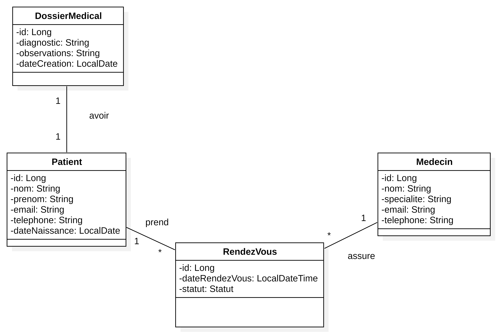
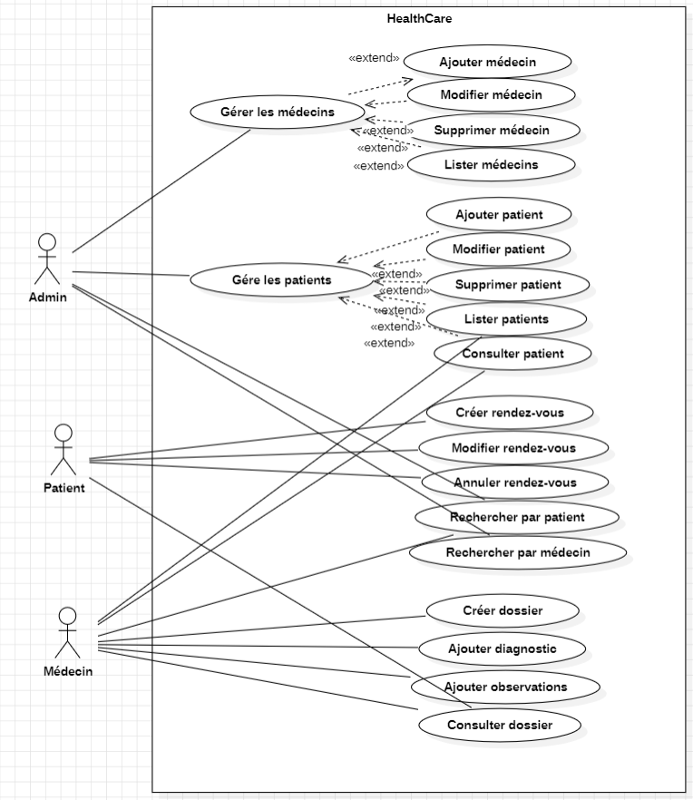
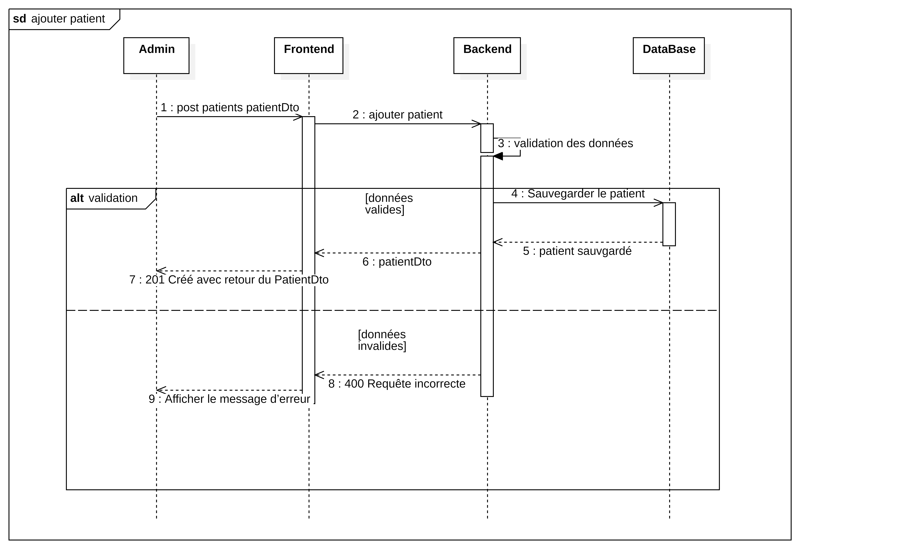
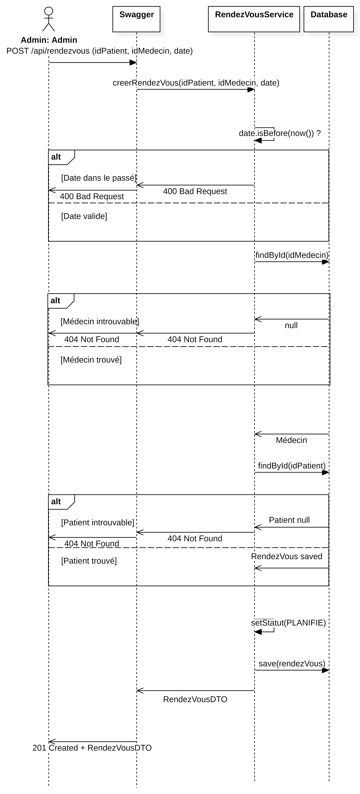

HealthCare+ – Système de gestion médicale

-Description:

HealthCare+ est une API REST développée avec Spring Boot permettant la gestion d’un système médical (patients, médecins, rendez-vous et dossiers médicaux).

-Objectif:

Développer une application backend structurée et maintenable pour la gestion d’un système de santé.

-Fonctionnalités:

* Patients
            -Ajouter, modifier, supprimer
            -Lister et consulter
* Médecins
            -Ajouter, modifier, supprimer
            -Lister
* Rendez-vous
            -Créer, modifier, annuler
Lister
Recherche par patient ou médecin
* Dossiers médicaux
            -Créer un dossier
            -Ajouter diagnostic et observations
            -Consulter le dossier

-Architecture
Architecture MVC (Controller, Service, Repository)
DTO + MapStruct
Spring Data JPA / Hibernate

-Technologies
Java 17/21, Spring Boot, JPA/Hibernate, Flyway, MySQL, Maven, Docker, JUnit, Swagger, Git

Diagrammes UML:

-Diagramme de classes :

-Diagramme de cas d’utilisation:

-Diagrammes de séquence:

-------------------------------------------------------------------------------------

les étapes de création des conteneurs : app & mysql

.\mvnw.cmd clean package -DskipTests

docker network create healthcare-net

docker build -t healthcare-img .

docker run -d --name db-mysql --network healthcare-net -e MYSQL_DATABASE=healthcare -e MYSQL_ROOT_PASSWORD=2002 -p 3307:3306 mysql:latest

timeout /t 20

docker run -d --name healthcare-app --network healthcare-net -p 8080:8080 -e "SPRING_DATASOURCE_URL=jdbc:mysql://db-mysql:3306/healthcare" -e "SPRING_DATASOURCE_USERNAME=root" -e "SPRING_DATASOURCE_PASSWORD=2002" healthcare-img